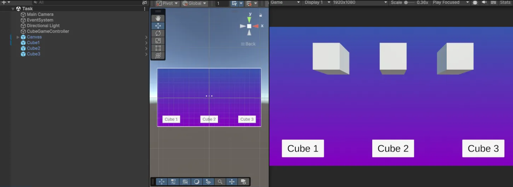
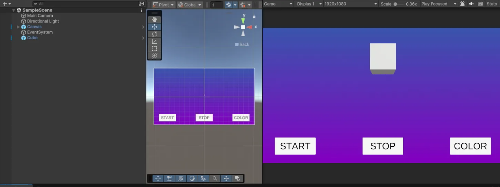

# Лабораторная работа №6



3.1



1. **Сцена**
    - На сцене размещены три куба: `Cube1`, `Cube2`, `Cube3`.
    - У всех кубов компонент **Rigidbody** с отключённой гравитацией (`useGravity = false`).
    - Создан UI Canvas с:
        - Тремя кнопками `CubeButton_1`, `CubeButton_2`, `CubeButton_3` под каждым кубом.
        - Текстом `Guess the Cube` по центру.
        - Текстом `You Win` (изначально отключен).
2. **Скрипт `CubeGameController.cs`**
    - Подключены публичные ссылки на Rigidbody кубов и объект `YouWinText`.
    - Переменная `correctCubeIndex` задаёт индекс правильного куба.
    - Метод `SelectCube(int index)` включается по нажатию кнопки:
        
        ```csharp
        using UnityEngine;
        
        public class CubeGameController : MonoBehaviour
        {
            public Rigidbody cube1, cube2, cube3;
            public GameObject winText;
            public int correctCubeIndex = 1; // от 1 до 3
        
            public void SelectCube(int index)
            {
                Debug.Log("Pressed: " + index); 
        
                cube1.useGravity = index != 1;
                cube2.useGravity = index != 2;
                cube3.useGravity = index != 3;
        
                if (index == correctCubeIndex)
                    winText.SetActive(true);
            }
        }
        ```
        
3. **Привязка UI**
    - Каждая кнопка вызывает метод `SelectCube(int)` с соответствующим значением 1, 2 или 3.
    - В поле `OnClick()` каждой кнопки подключён объект `CubeGameController`.

---

### Итоговый вывод:

В результате выполнения задания был создан простой игровой интерфейс в Unity с кнопками. Пользователь выбирает куб, который по его мнению не упадёт. Остальные кубы падают, и если выбор правильный - появляется надпись "YOU WIN". В процессе работы получилось лучше разобраться с UI, подключением скриптов к кнопкам и управлением физикой объектов в Unity.
